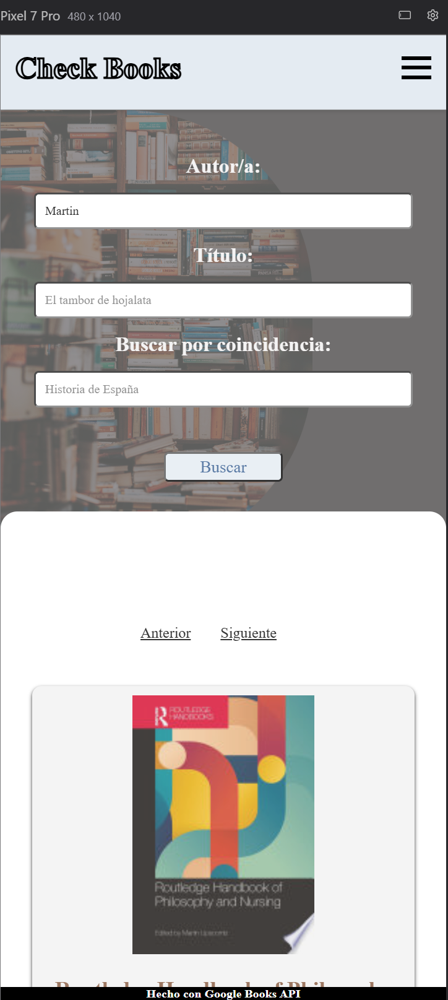
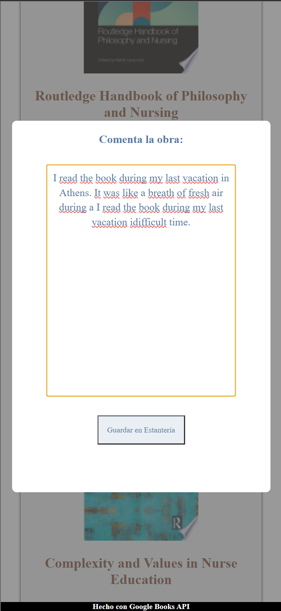
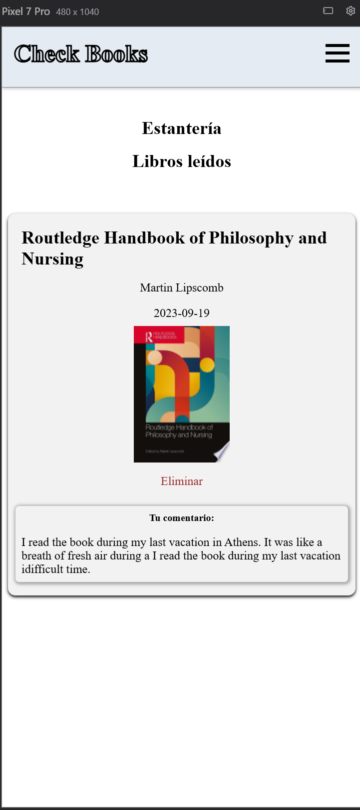

# 🧠 Check Books

A production-oriented React application that integrates with the Google Books API to search, organize, and manage personal reading collections.

**Check Books** allows users to search for books, categorize them into different reading states (Library & Bookshelf), and attach personal notes for contextual reference.

This project reflects early-stage production thinking with a strong focus on frontend architecture, API-driven design, and structured state management.

---

## 📸 Application Preview

### 🔍 Search Interface
<p>
  
</p>

### 💬 Comment Modal
<p>
  
</p>

### 📚 Bookshelf (Read Books)
<p>
  
</p>

> Screenshots are located inside the `/screenshots` folder at the repository root.

---

## 🚀 Core Features

- Search books using the Google Books API
- Multi-field search (author, title, free query)
- Pagination support via dynamic `startIndex`
- Save books into two states:
  - 📖 Library (to read)
  - 📚 Bookshelf (read)
- Move books from Library → Bookshelf
- Attach personal notes to books
- Delete books from collections
- Basic client-side authentication
- Persistence:
  - User stored in `localStorage`
  - Session flag stored via cookies
- Global state management via React Context
- Request cancellation using `AbortController`
- Environment-based API key configuration

---

## 🏗 Architectural Overview

The project follows a modular structure separating:

- **Container components** (logic & data fetching)
- **Pure/presentational components** (UI rendering)
- **Context providers** (global state)
- **Route-level pages** (composition)

### 📦 Folder Structure

```text
src/
 ├── assets/
 ├── components/
 │    ├── container/        → Data & API logic
 │    ├── pure/             → Stateless UI components
 │    ├── pages/            → Route-level components
 │    └── presentation/     → Layout/UI sections
 ├── routes/                → Routing configuration
 ├── useContext/            → Global state providers
 ├── App.jsx
 └── main.jsx
```

---

## 🔁 Flow Diagram

```text
User inputs search fields
        ↓
FormQuery (collects values)
        ↓
ApiQuery (builds query + fetch)
        ↓
Google Books API
        ↓
Normalize response (volumeInfo)
        ↓
Results list
        ↓
User actions
  ├─ Save to Library
  ├─ Save to Bookshelf
  └─ Add comment (Modal)
        ↓
Context state update
        ↓
Persist to localStorage
```

---

## 🧠 State Management

Global state is handled via **React Context**:

- **UserContext** → authentication state
- **ModalContext** → comment modal state
- **CounterContext** → pagination control

API logic is isolated inside **ApiQuery** and uses:

- `useEffect`
- `AbortController`
- `URLSearchParams`
- defensive error handling

---

## 🛠 Tech Stack

- React 18
- React Router DOM
- Vite
- Context API
- Google Books API
- localStorage
- js-cookie
- ESLint

---

## 🔑 Environment Variables

Create a `.env` file in the root directory:

```bash
VITE_GOOGLE_BOOKS_KEY=your_api_key_here
```

---

## 💻 Installation & Run

```bash
git clone https://github.com/<your-username>/check-books.git
cd check-books
npm install
npm run dev
```

---

## 🔍 Technical Highlights

- Dynamic query composition (`inauthor`, `intitle`, free query)
- Defensive API handling (empty results, HTTP errors)
- Request cancellation to prevent race conditions
- Modular component structure and separation of concerns
- Controlled forms with pattern validation
- Persistent collections using `localStorage`

---

## ⚠️ Design Trade-offs

This is a client-only application:

- No backend authentication
- Password stored in `localStorage` (educational/demo purpose)
- No server-side persistence
- No encryption layer

These decisions were made to focus on frontend architecture and API integration.

---

## 📈 Improvements Roadmap

- Backend authentication (JWT + hashed passwords)
- Database persistence (users + collections)
- Migration to TypeScript
- Automated testing (unit + integration)
- Better UI validation and error feedback
- Accessibility improvements (ARIA, keyboard navigation)
- Production deployment pipeline (CI + preview builds)

---

## 🎯 Project Intent

This project demonstrates:

- API integration patterns
- State-driven UI architecture
- Production-oriented thinking in early frontend development
- Clear separation of concerns
- Awareness of real-world trade-offs

---

## 👤 Author

**Isaac Ortega Acosta**  
Frontend / Full-Stack Developer — React · TypeScript · SaaS  
EU Citizen — Relocating to Nicosia (immediate)
